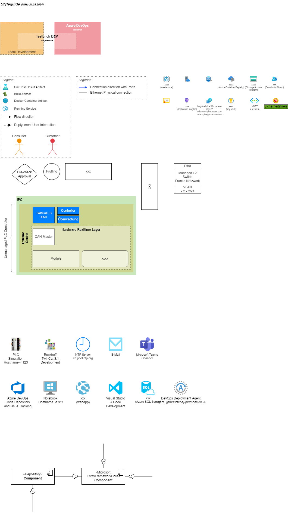

# Architecture stuff

## Drawing Styleguide

- Use [drawio](https://draw.io/) to create diagrams!
  - Save the files as `.drawio.png` alternative use `.drawio.svg`. This way, we can see the preview and send it directly around and everyone know it was created with drawio 😀
  - Use the VS Code Extension [hediet.vscode-drawio](https://marketplace.visualstudio.com/items?itemName=hediet.vscode-drawio) to edit the diagrams directly in VS Code.
  - When embed images in drawio use alwayse svg files. They are smaller and can be scaled without loss of quality.

## Example Diagrams

