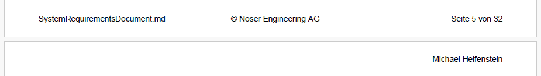

# Documentation with Markdown

## Generation of Markdown Documentation

### Create a PDF of a Markdown file

Install the VSCode extension [yzane.markdown-pdf](https://marketplace.visualstudio.com/items?itemName=yzane.markdown-pdf) and follow the instructions.

The following paramter should be changed for a good output experience:

```json
"markdown-pdf.footerTemplate": "<div style=\"font-size: 9px; margin-left: 1cm;\"> <span class='title'></span></div>          <div style=\"font-size: 9px; margin: 0 auto;\"> © Noser Engineering AG</div>          <div style=\"font-size: 9px; margin-left: auto; margin-right: 1cm; \"> Seite <span class='pageNumber'></span> von <span class='totalPages'></span></div>",
"markdown-pdf.headerTemplate": "<div style=\"font-size: 9px; margin-left: auto; margin-right: 1cm; \"> Michael Helfenstein</span></div>",
```

This results in:



### Create a Word docx of a Markdown file

Install pandoc in WSL with the following command: `apt install pandoc`

1. create a [reference.docx template](assets/reference.docx) with all formatting
`pandoc -o custom-reference.docx --print-default-data-file reference.docx >reference.docx`
2. open reference.docx and adjust formatting
3. convert a markdown with a formatted template reference.docx, attention: -data-dir must specify the location where the file specified in --template is located! -s stands for input and -o for output. Use the following pattern: `pandoc --data-dir $templateFolder --template $templatefile -s $inputFile -o $outputFile` e.g.
`pandoc --data-dir . --template reference.docx -s SystemRequirementsDocument.md -o out3.docx`

> see [Pandoc cli parameters](https://pandoc.org/MANUAL.html) and [how-do-i-add-custom-formatting-to-docx-files-generated-in-pandoc](https://stackoverflow.com/questions/70513062/how-do-i-add-custom-formatting-to-docx-files-generated-in-pandoc)

### Create html website from multible Markdown files

A easy way is to use [docfx](https://dotnet.github.io/docfx) to generate documenation. A sample use-case can be found at [log4TC](https://github.com/mbc-engineering/log4TC) repository with [csproj build file](https://github.com/mbc-engineering/log4TC/blob/master/docs/DocFxBuild.targets) and the [docfx.json](https://github.com/mbc-engineering/log4TC/blob/master/docs/docfx.json) konfiguration file. The result is deployed to the github page [https://mbc-engineering.github.io/log4TC/](https://mbc-engineering.github.io/log4TC/).